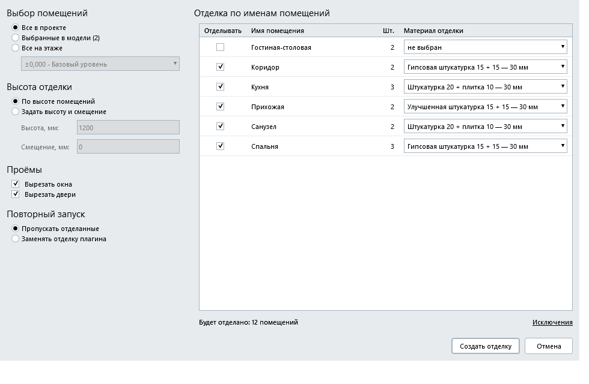
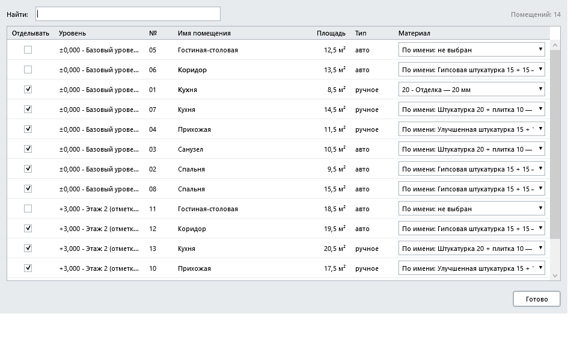
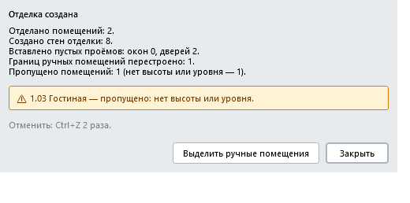

# Отделка стен по помещениям для Renga

Плагин для [Renga](https://rengabim.com): строит отделку стен по контурам помещений. Вдоль каждого выбранного помещения создаёт тонкие стены из выбранного многослойного материала (например, «штукатурка 20 + плитка 10») и сразу вырезает в них проёмы под окна и двери.

Версия 0.1.

> Картинки в этом README - отрисовка окон плагина в тестовом приложении (с условными данными), а не снимки экрана из Renga: в самой Renga у окон есть заголовок и рамка, а имена и материалы будут вашими.

## Возможности
- **Выбор помещений**: все в проекте, выбранные в модели (выделите помещения перед запуском) или все на выбранном этаже.
- **Правила «имя помещения → материал»**: для каждого имени помещения (например, «Кухня») выбирается материал отделки из многослойных материалов группы «Стены»; правило действует на все помещения с этим именем. Выбор запоминается между запусками.
- **Исключения**: отдельное окно со списком помещений - можно снять отметку у помещения или задать ему материал в обход правила по имени.
- **Высота отделки**: по высоте помещения или заданная высота со смещением от уровня (например, панель на 1200 мм от пола). Проёмы окон и дверей обрезаются по этой высоте.
- **Проёмы**: против каждого окна и каждой двери в стене отделки вырезается пустой проём того же размера и на том же месте (можно отключить отдельно для окон и дверей).
- **Колонны внутри помещений** облицовываются так же, как колонны и стены на границе помещения.
- **Автоматические и ручные помещения**: автоматические Renga перестраивает сама по лицевой грани отделки (плагин следит, чтобы помещение не пропало); границы ручных помещений плагин сдвигает сам, а если не получилось - показывает их списком и умеет выделить в модели.
- **Повторный запуск**: «Пропускать отделанные» или «Заменять отделку плагина» (удаляется только то, что создал сам плагин, по метке).
- **Отмена**: два шага Ctrl+Z (три в режиме «Заменить» или при проёмах непрямоугольной формы). Итоговое окно подсказывает, сколько раз нажать.

## Требования
- Windows.
- Renga с поддержкой плагинов .NET 8 (в манифесте указан API 2.49).

## Установка
1. Скачайте архив `WallFinish-0.1.zip` на странице [Releases](../../releases).
2. Закройте Renga.
3. Распакуйте архив и скопируйте папку `WallFinish` в `C:\Program Files\Renga Professional\Plugins\` (потребуются права администратора).
4. Запустите Renga: на ленте появится кнопка «Отделка стен».

Если кнопки нет, посмотрите журнал `%localappdata%\Renga Software\Renga Professional\AecApp.log`. Журнал самого плагина - `%APPDATA%\WallFinish\`.

## Как пользоваться
1. (Необязательно) выделите в модели помещения, которые нужно отделать.
2. Нажмите «Отделка стен» на ленте.
3. Выберите, какие помещения брать: все, выбранные или на этаже.
4. В таблице справа выберите материал для каждого имени помещения. Строки без материала отделываться не будут.
5. При необходимости откройте «Исключения» и поправьте отдельные помещения.
6. Задайте высоту отделки, галочки «Вырезать окна/двери» и режим повторного запуска.
7. Нажмите «Создать отделку» и дождитесь итогового окна: в нём числа и предупреждения. Запись больших проектов может занять до минуты, Renga в это время не отвечает (около 0,2 с на стену).
8. Результат можно отменить Ctrl+Z (см. подсказку в итоговом окне).

## Известные ограничения
- **Порядок слоёв**: первый слой материала (слой 0) оказывается у несущей стены, последний - в помещении. Это наблюдение автора, программно Renga этого не сообщает: проверьте на своём материале (например, «штукатурка 20 + плитка 10»).
- Если концы стен отделки совпадают с концами несущей стены, Renga срезает у несущей стены небольшой клин в углу. Отмена Ctrl+Z возвращает стену точно.
- Углы стен отделки соединяет сама Renga; непрямые углы специально не проверялись.
- Пустые проёмы отделки попадают в спецификации окон и дверей. Чтобы их исключить, отфильтруйте по свойству «Отделка стен: помещение» (оно задано у всех объектов плагина).
- Круглые колонны не проверялись. Шахты и другие внутренние контуры из стен не отделываются.
- Во время записи нет индикатора прогресса.
- Автоматическое помещение может перестроиться иначе, если его контрольная точка расположена рядом со стеной. В таком случае плагин предупреждает в итоговом окне («помещение пропало после отделки, проверьте»).
- Если после отделки сдвинуть окно или дверь, отделка сама не обновится - запустите плагин в режиме «Заменить».
- Копия стены отделки, сделанная вручную, несёт метку плагина и будет удалена режимом «Заменить».

## English (short)
Renga plugin that creates wall finish (thin multilayer walls) along room contours, with empty window/door openings cut to match the host walls. Room selection (all / selected / by level), name-to-material rules with per-room exceptions, fixed or room-based finish height, columns inside rooms, automatic and manual rooms, "Skip / Replace" on re-run, 2 steps of Ctrl+Z to undo. Requires Renga with plugin API 2.49 (.NET 8). Install: unzip `WallFinish-0.1.zip` into `C:\Program Files\Renga Professional\Plugins\WallFinish\` (administrator rights), restart Renga. Windows UI is in Russian only.

## О разработке
Плагин разработан с помощью искусственного интеллекта (Claude, Anthropic) под руководством автора. Работа плагина проверялась автором в Renga на тестовых проектах, но программа поставляется «как есть», без гарантий: перед использованием на важных проектах проверьте результат (отделка отменяется Ctrl+Z).

## Лицензия
Все права защищены, см. [LICENSE](LICENSE). Исходный код не публикуется. Сторонние компоненты: Renga.WPF.Styles (MIT), сборки Renga SDK.
